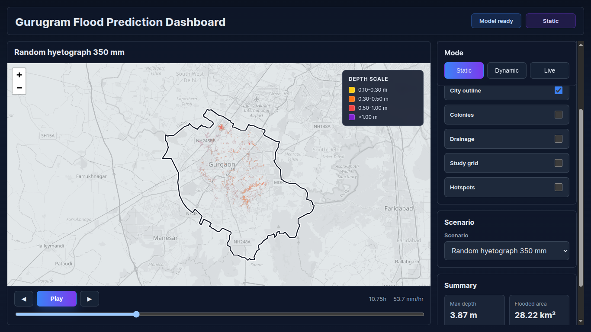
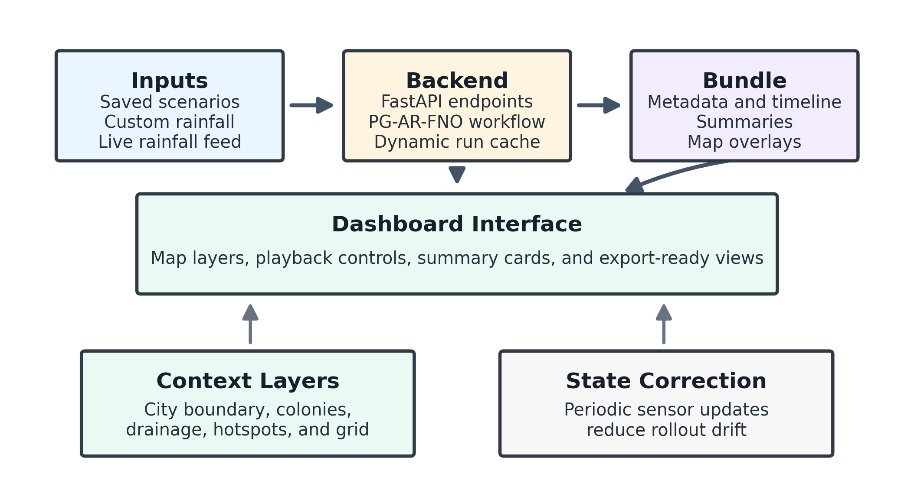

# Gurugram Flood Prediction Dashboard

This repository contains the application layer used to present PG-AR-FNO flood predictions for Gurugram through an interactive dashboard. It was prepared as the software artifact associated with the thesis work on urban flood prediction.

## Overview

The dashboard is built around three operating modes:

- `Static`: review saved flood scenarios through precomputed assets
- `Dynamic`: submit a rainfall sequence and generate a run through the same display pipeline
- `Live`: fetch rainfall from a weather service and create a live-style prediction run

The interface combines:

- map-based flood visualization
- scenario and mode selection
- playback across time
- switchable layers such as water depth, flood extent, hazard bands, and risk cells
- contextual layers such as city boundary, colonies, drainage, and hotspots
- summary indicators for the active frame

## Screens

### Home screen



### Software architecture



## Repository contents

- `api/`: request and response schemas
- `assets/`: static scenario assets and GIS context layers
- `core/`: prediction, bundling, hazard, and alert logic
- `data/`: city profile metadata
- `services/`: weather service integration
- `static/`: frontend HTML, CSS, and JavaScript
- `server.py`: FastAPI entrypoint

## Running the dashboard

Run the app from the parent thesis workspace:

```bash
conda activate shivam
python -m uvicorn app.server:app --host 0.0.0.0 --port 8009
```

Then open:

```text
http://127.0.0.1:8009
```

## Dependencies

The included `requirements.txt` lists the Python packages used by the app. The main runtime dependencies are:

- `fastapi`
- `uvicorn`
- `numpy`
- `pillow`
- `pydantic`
- `torch`

## Live rainfall setup

To enable live rainfall retrieval, set:

```bash
export OPENWEATHERMAP_API_KEY=your_key_here
```

If the key is unavailable or the weather request fails, the app falls back to a clearly labelled demonstration rainfall sequence so that the interface remains usable.

## Scope note

This repository is the dashboard application snapshot used for thesis presentation and review. It focuses on the software interface, saved assets, and backend service flow around the prediction workflow.
